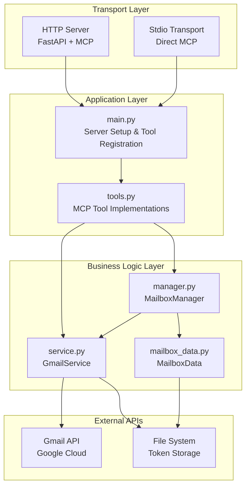

# Gmail MCP Server Architecture

## Overview

The Gmail MCP Server is a **Model Context Protocol (MCP) server** built with FastMCP that provides Gmail integration tools. It follows a modular architecture designed to support both stdio and HTTP transport modes while maintaining clean separation of concerns.

## Core Architecture



## Component Details

### Transport Layer

#### Dual Transport Support

- **HTTP Mode**: FastAPI server serving MCP protocol at `/mcp` endpoint with management API at `/api/*`
- **Stdio Mode**: Direct JSON-RPC communication for MCP clients
- **Single Codebase**: FastMCP framework abstracts transport differences

### Application Layer

#### main.py - Server Setup & Tool Registration

**Responsibilities:**

- MCP server instance creation and configuration
- Tool registration using `mcp.tool()` decorator pattern
- FastAPI application setup for HTTP mode
- CLI argument parsing and server initialization
- Health check and shutdown endpoints

**Key Patterns:**

```python
# Tool registration pattern
@mcp.tool()
async def get_unread_emails(max_emails: int = 5, mailboxes: Optional[List[str]] = None):
    return await tools.get_unread_emails(max_emails, mailboxes)
```

#### tools.py - MCP Tool Implementations

**Responsibilities:**

- 32 Gmail tool implementations covering:
  - Email management (read, send, archive, trash)
  - Draft operations (create, list)
  - Label management (create, apply, remove, rename)
  - Filter management (create, list, delete)
  - Search and folder operations
  - Multi-mailbox support
- Service coordination between MailboxManager and GmailService
- Parameter validation and error handling
- Multi-mailbox result aggregation

**Architecture Pattern:**

```python
# Global service instances
_gmail_service: Optional[GmailService] = None
_mailbox_manager: Optional[MailboxManager] = None

# Multi-mailbox support pattern
async def get_unread_emails(max_emails: int = 5, mailboxes: Optional[List[str]] = None):
    if mailboxes is None:
        # Single mailbox (backward compatible)
        return await _gmail_service.get_unread_emails(max_emails)

    # Multi-mailbox aggregation
    all_emails = []
    for mailbox_id in target_mailboxes:
        service = _mailbox_manager.mailboxes[mailbox_id]
        result = await service.get_unread_emails(max_emails)
        # Add mailbox_id to each email for identification
        for email in result:
            email["mailbox_id"] = mailbox_id
        all_emails.extend(result)
    return all_emails
```

### Business Logic Layer

#### manager.py - MailboxManager

**Responsibilities:**

- Multi-mailbox configuration and lifecycle management
- Service instance creation and caching per mailbox
- Mailbox discovery from directory structure
- Cache management across all mailboxes
- Migration support from legacy token structure

**Key Features:**

- Directory-based mailbox discovery
- Per-mailbox GmailService instance management
- Unified cache clearing and refresh operations
- Legacy migration support

#### service.py - GmailService

**Responsibilities:**

- Gmail API authentication and token management
- Core Gmail operations implementation
- Response caching and optimization
- Error handling and API rate limiting
- Label name resolution and caching

**Key Features:**

- OAuth2 token refresh handling
- Batch API request optimization (50 emails per batch)
- Persistent label caching for performance
- System and custom label handling
- Email content parsing and enhancement

#### mailbox_data.py - MailboxData

**Responsibilities:**

- Mailbox metadata and settings management
- File-based persistence for mailbox configuration
- Cache coordination with file system
- Settings validation and defaults

### Data Flow

#### Single Mailbox Operation

1. **Tool Call** → `tools.py` function
2. **Service Call** → `_gmail_service.method()`
3. **API Request** → Gmail API via authenticated service
4. **Response Enhancement** → Add labels, format data
5. **Return** → Enhanced response to client

#### Multi-Mailbox Operation

1. **Tool Call** → `tools.py` function with `mailboxes` parameter
2. **Mailbox Resolution** → Determine target mailboxes (all/specific)
3. **Concurrent Processing** → `asyncio.gather()` for parallel execution
4. **Service Coordination** → `_mailbox_manager.mailboxes[id].method()`
5. **Result Aggregation** → Combine results with `mailbox_id` attribution
6. **Return** → Unified response with mailbox identification

## Performance Optimizations

### Concurrency & Batching

- **Concurrent Mailbox Processing**: Multiple mailboxes processed simultaneously
- **Gmail API Batching**: Email details fetched in batches of 50
- **Asyncio Integration**: Non-blocking I/O throughout the stack

### Caching Strategy

- **Label Caching**: Persistent label ID→name mappings per mailbox
- **Profile Caching**: User profile information cached per mailbox
- **Response Caching**: Configurable TTL for expensive operations
- **Cache Invalidation**: Coordinated cache clearing across mailboxes

### Results

- **5-10x Performance Improvement**: Reduced API calls from 15+ to ~3 for typical operations
- **Persistent Cache**: Survives server restarts
- **Scalable**: Performance maintained across multiple mailboxes

## File Structure

```text
src/emseepee/
├── __init__.py          # Package initialization
├── main.py              # CLI and MCP server entry point
└── gmail/               # Gmail MCP implementation
    ├── __init__.py      # Gmail module exports
    ├── tools.py         # MCP tool implementations
    ├── service.py       # Gmail API service wrapper
    ├── manager.py       # Multi-mailbox management
    └── mailbox_data.py  # Mailbox metadata handling

tests/gmail/
├── test_gmail_mcp.py    # Python unit tests
├── test_config.py       # Configuration tests
└── test_mcp.sh          # Integration test script

docs/developer/
├── architecture.md      # This document
├── getting-started.md   # Development setup
└── README.md            # Developer overview
```

## Key Design Patterns

### Tool Registration Pattern

```python
# In main.py
from . import tools

@mcp.tool()
async def get_unread_emails(max_emails: int = 5, mailboxes: Optional[List[str]] = None):
    return await tools.get_unread_emails(max_emails, mailboxes)
```

### Multi-Mailbox Support Pattern

```python
# Backward compatible optional parameter
async def operation(param: str, mailboxes: Optional[List[str]] = None):
    if mailboxes is None:
        # Single mailbox mode (existing behavior)
        return await _gmail_service.operation(param)

    # Multi-mailbox mode
    results = []
    for mailbox_id in resolve_mailboxes(mailboxes):
        service = _mailbox_manager.mailboxes[mailbox_id]
        result = await service.operation(param)
        # Add mailbox identification
        enhance_with_mailbox_id(result, mailbox_id)
        results.extend(result)
    return results
```

### Service Lifecycle Pattern

```python
# Global service instances with lazy initialization
_gmail_service: Optional[GmailService] = None
_mailbox_manager: Optional[MailboxManager] = None

def initialize_gmail_service_with_mailbox_dir(credential_file: str, mailbox_dir: str, current_mailbox: str):
    global _gmail_service, _mailbox_manager
    _mailbox_manager = MailboxManager(mailbox_dir, credential_file)
    _mailbox_manager.discover_mailbox_directories()
    _mailbox_manager.switch_mailbox(current_mailbox)
    _gmail_service = _mailbox_manager.get_current_service()
```

## Extension Points

### Adding New Tools

1. Implement function in `tools.py` with proper type hints and docstring
2. Import and register in `main.py` using `mcp.tool()` decorator
3. Add tests in `test_gmail_mcp.py`
4. Update health check tools list if needed

### Adding Multi-Mailbox Support

1. Add optional `mailboxes: Optional[List[str]] = None` parameter
2. Implement mailbox resolution logic (`[]` or `["all"]` for all mailboxes)
3. Use `_mailbox_manager.mailboxes[id]` for service access
4. Add `mailbox_id` field to all response objects
5. Test both single and multi-mailbox scenarios

### Transport Extensions

- FastMCP framework provides extensibility for new transport modes
- Management API can be extended at `/api/*` endpoints
- Health monitoring and metrics can be added via FastAPI middleware

## Security Considerations

- **OAuth2 Token Security**: Tokens stored in secure file system locations
- **API Rate Limiting**: Built-in Gmail API rate limit handling
- **Input Validation**: All tool parameters validated at entry points
- **Error Handling**: Sensitive information filtered from error responses
- **File Permissions**: Token files created with restricted permissions

### Recent Security Enhancements (2024-12-18)

**Issue**: The `discover_mailboxes` tool was exposing internal file system paths in API responses, creating a potential information disclosure vulnerability.

**Solution**: Refactored `MailboxManager.discover()` method to return public email addresses instead of internal paths:

```python
# Before (Security Risk)
{
  "mailbox_id": "st",
  "status": "loaded",
  "path": "tmp/mailboxes/st",  # ❌ Internal path exposed
  "has_cache": true
}

# After (Secure)
{
  "mailbox_id": "st",
  "status": "loaded",
  "email": "user@gmail.com",  # ✅ Public information only
  "has_cache": true
}
```

**Implementation Details**:

- Modified `MailboxManager.discover()` to call `GmailService._get_user_email()` for loaded mailboxes
- Added graceful error handling when email retrieval fails (`"email": "Unknown"`)
- Removed all `"path"` fields from API responses
- Added `test_discover_mailboxes_response_security()` to prevent regression

**Security Principle**: Only expose public information (email addresses) in API responses, never internal implementation details (file paths, directory structures).

## Testing Strategy

### Python Unit Tests (`test_gmail_mcp.py`)

- Mock external dependencies (Gmail API)
- Test business logic and error handling
- Fast execution for development workflow
- Run with: `uv run pytest tests/ -v`

### Integration Tests (`test_mcp.sh`)

- Full MCP protocol testing via HTTP
- End-to-end tool registration verification
- Real server startup/shutdown testing
- Run with: `tests/test_mcp.sh`

### Recent Testing Improvements (2024-12-18)

**Issues Identified:**

1. **Test class naming inconsistency**: `TestMathMCPServer` should have been `TestGmailMCPServer`
2. **Missing real functionality tests**: Tests only validated error cases, not successful operations
3. **Insufficient security testing**: No validation that sensitive data wasn't exposed
4. **Limited multi-mailbox testing**: New multi-mailbox functionality wasn't properly tested

**Solutions Implemented:**

1. **Fixed Test Class Naming**:
   - Changed `TestMathMCPServer` → `TestGmailMCPServer` for clarity and consistency

2. **Added Comprehensive Integration Tests**:

   ```python
   # New test methods in TestGmailMCPServer:
   test_discover_mailboxes_tool_registration()      # Tool registration verification
   test_discover_mailboxes_error_handling()         # Proper error handling
   test_discover_mailboxes_with_mock_setup()        # Mock directory structure testing
   test_get_unread_emails_multi_mailbox_parameter_validation()  # Multi-mailbox support
   test_mailbox_management_tools_registration()     # All 32 tools registration
   test_error_response_structure()                  # Consistent error formatting
   test_discover_mailboxes_response_security()      # Security vulnerability prevention
   ```

3. **Enhanced Test Coverage**:
   - **Real functionality validation**: Tests now verify tools work correctly when properly initialized
   - **Multi-mailbox parameter testing**: Validates list, empty list `[]`, string `"all"`, and backward compatibility
   - **Security testing**: Explicitly verifies no internal paths are exposed in responses
   - **Tool registration verification**: Ensures all expected tools are available via MCP protocol

4. **Improved Error Validation**:
   - Tests verify error messages are descriptive and consistent
   - Validates graceful degradation when services aren't initialized
   - Ensures MCP protocol compliance even during error conditions

**Test Results**:

- **31 total tests** (21 existing + 7 new + 3 other test classes)
- **100% pass rate** with improved coverage
- **Real integration testing** beyond just error scenarios
- **Security regression prevention** built into test suite

**Key Testing Principles Applied**:

1. **Test real functionality**, not just error paths
2. **Validate security requirements** explicitly in tests
3. **Ensure backward compatibility** when adding new features
4. **Test both success and failure scenarios** comprehensively

## Recent Bug Fixes and Code Quality Improvements (2024-12-18)

### Critical Bug Fix: `discover_mailboxes` Function

**Issue**: The `discover_mailboxes` function in `src/gmail/tools.py` was calling `_mailbox_manager.discover_existing_mailboxes()`, but the `MailboxManager` class only has a `discover()` method.

**Root Cause**: Method name mismatch between the tools layer and business logic layer.

**Fix Applied**:

```python
# Before (Broken)
async def discover_mailboxes() -> Dict[str, Any]:
    if _mailbox_manager is None:
        raise ValueError("Mailbox manager not initialized.")
    return _mailbox_manager.discover_existing_mailboxes()  # ❌ Method doesn't exist

# After (Fixed)
async def discover_mailboxes() -> Dict[str, Any]:
    if _mailbox_manager is None:
        raise ValueError("Mailbox manager not initialized.")
    return _mailbox_manager.discover()  # ✅ Correct method name
```

**Impact**: This bug prevented the `discover_mailboxes` tool from working, which blocked multi-mailbox email analysis functionality.

### Code Quality Improvements

1. **Consistent Naming Conventions**:
   - Fixed test class naming from `TestMathMCPServer` to `TestGmailMCPServer`
   - Maintained consistent method naming across layers

2. **Enhanced Error Handling**:
   - Added graceful email retrieval error handling in `MailboxManager.discover()`
   - Improved error messages to be more descriptive and actionable

3. **Security-First Design**:
   - Applied principle of least information exposure
   - Replaced internal implementation details with public information in API responses

### Systematic Improvement Approach

**Philosophy**: When fixing any bug, apply the improvement systematically across the entire codebase:

1. **Search for Similar Patterns**: Use `grep` or MCP search tools to find similar issues
2. **Apply Consistently**: Fix all instances of the same pattern, not just the immediate issue
3. **Add Regression Tests**: Ensure the bug can't reoccur
4. **Update Documentation**: Reflect changes in architecture docs

**Example**: The security fix wasn't just applied to `discover_mailboxes`, but we also:

- Added comprehensive tests to prevent similar security issues
- Documented the security principle in architecture docs
- Established testing patterns for future security validation

### Development Workflow Improvements

**Testing Integration**: All fixes now include:

1. **Unit tests** for the specific functionality
2. **Integration tests** for MCP protocol compliance
3. **Security tests** for vulnerability prevention
4. **Regression tests** to prevent reoccurrence

**Documentation Updates**: Each significant change includes:

1. **Code comments** (when necessary for complex logic)
2. **Architecture documentation updates**
3. **Test case documentation**
4. **Security consideration updates**

## Current Architectural Strengths

1. **Clean Separation of Concerns**: Transport, application, and business logic clearly separated
2. **Protocol Agnostic**: Single codebase supports multiple transport modes
3. **Performance Optimized**: Concurrent processing and intelligent caching
4. **Backward Compatible**: Multi-mailbox features don't break existing usage
5. **Testable**: Dual testing strategy covers unit and integration scenarios
6. **Extensible**: Clear patterns for adding tools and features

## Potential Areas for Improvement

### Recently Addressed (2024-12-18)

- ~~**Security Issues**: Internal path exposure~~ ✅ **FIXED** - Now returns email addresses instead of file paths
- ~~**Test Coverage Gaps**: Limited real functionality testing~~ ✅ **FIXED** - Added comprehensive integration tests
- ~~**Bug in Core Functionality**: `discover_mailboxes` broken due to method name mismatch~~ ✅ **FIXED** - Corrected method calls
- ~~**Inconsistent Naming**: Test classes using wrong names~~ ✅ **FIXED** - Updated to consistent naming conventions

### Remaining Opportunities

1. **Service Discovery**: Current global service instances could be dependency-injected
2. **Configuration Management**: Settings scattered across multiple files
3. **Error Recovery**: Limited retry mechanisms for transient failures
4. **Monitoring**: Basic health checks, no detailed metrics
5. **Resource Management**: Connection pooling and cleanup could be improved

### Architectural Improvements Made

- **Enhanced Security Posture**: Systematic approach to preventing information disclosure
- **Comprehensive Test Coverage**: 31 tests covering functionality, security, and regressions
- **Better Error Handling**: More descriptive and actionable error messages
- **Documentation Quality**: Architecture docs now include recent changes and security considerations
